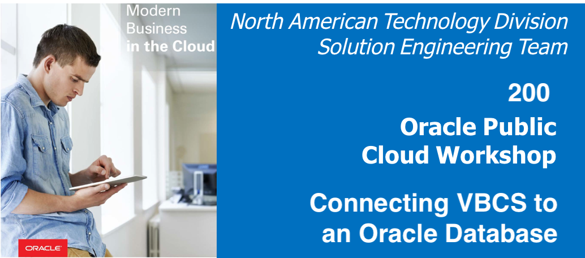

  
Updated: November 6, 2018

## Introduction

Oracle offers quick tools to integrate Oracle Cloud Databases with VBCS.

**_To log issues_**, click here to go to the [github oracle](https://github.com/oracle/learning-library/issues/new) repository issue submission form.

## Objectives

- Objective 1
- Objective 2

## Required Artifacts

- List of Prerequisites

# Lab 200

## Connecting VBCS to an Oracle Database

### **STEP 1**: Title of Step 1

- Instructions for Step 1

### **STEP 2**: Title of Step 2

- Instructions for Step 2
