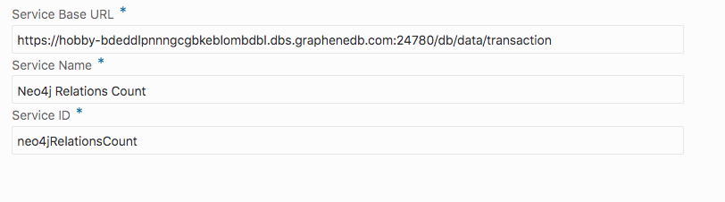
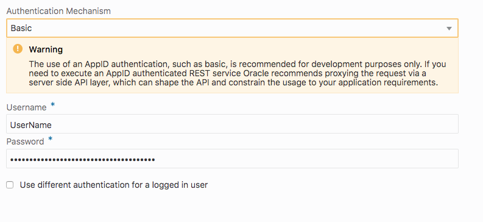
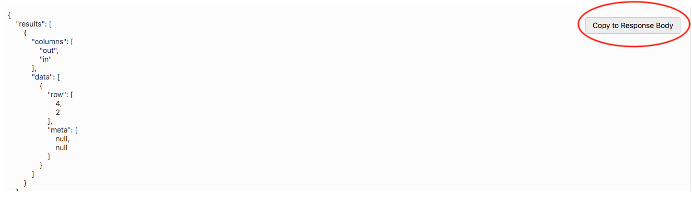
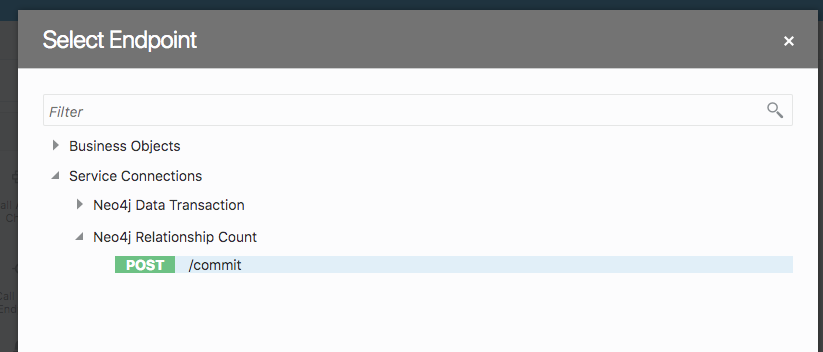
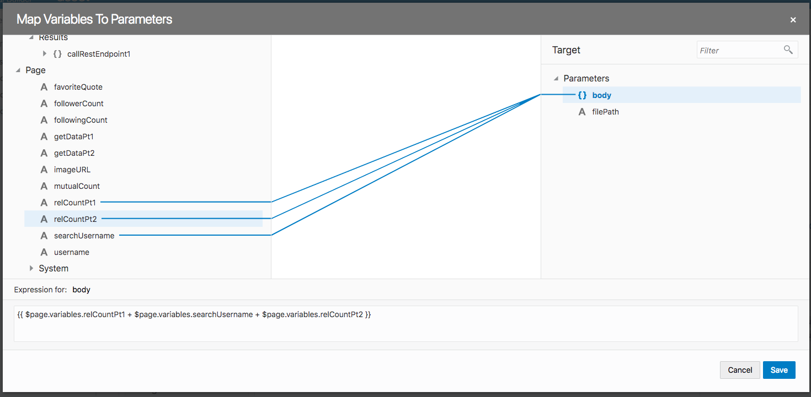
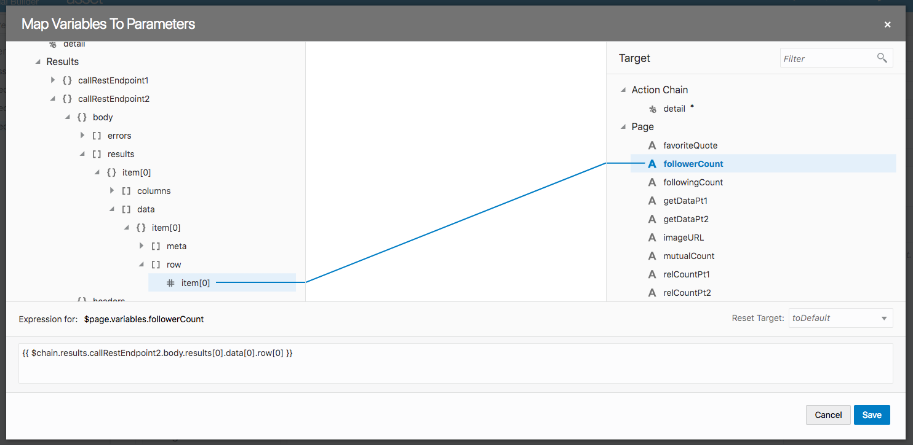
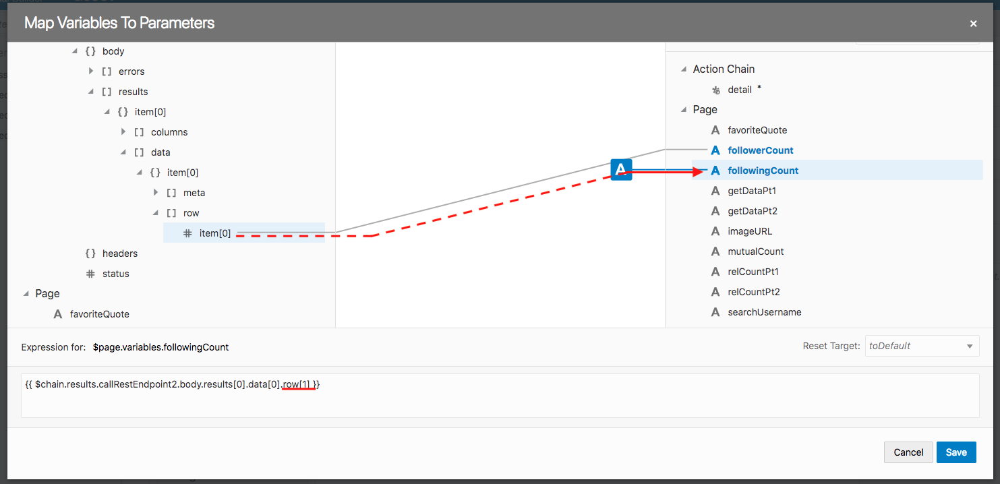
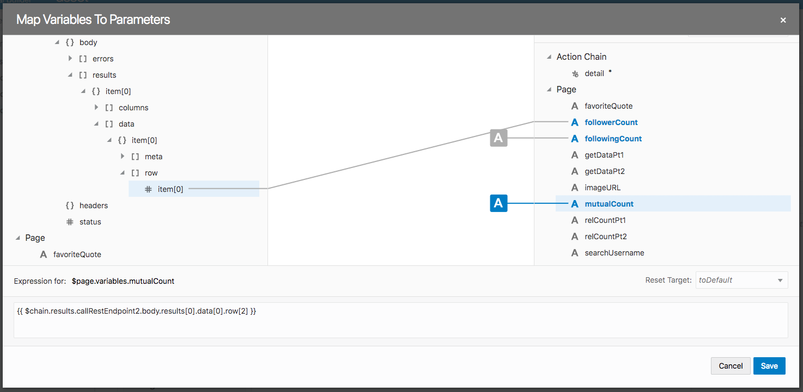
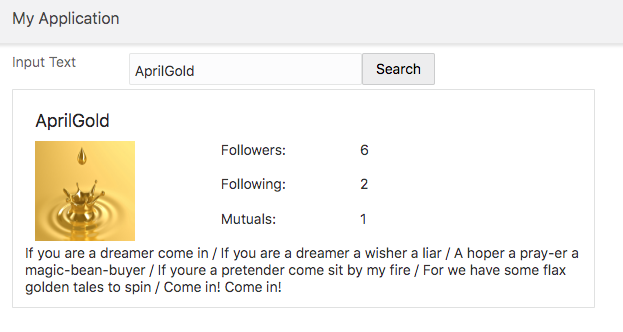

  
Updated: November 6, 2018

## Introduction

In this part of the lab, we'll learn a bit about how Graph Databases work, and see how to integrate them with VBCS. Specifically, we'll be using a free Graph Database called Neo4j.

**_To log issues_**, click here to go to the [github oracle](https://github.com/oracle/learning-library/issues/new) repository issue submission form.

## Objectives

- Seting up a Neo4j Database
  - Using GrapheneDB
- Getting Familiar with Graph Databases
  - Cypher statements
- Showing User Data on VBCS

## Required Artifacts

- A Cloud trial account

# Lab 400

## Connecting VBCS to a Graph Database (Neo4j)

### **STEP 1**: Set Up Neo4j Database

<details>
  <summary> Make a GrapheneDB Account and Database </summary>
  <br>
  
  GrapheneDB is an easy way to get up and running with Neo4j, with a free sandbox trial. <br> Visit [Graphene DB](https://app.graphenedb.com/) and sign up for an account. Login to the dashboard, then click `Create Database`.
  
  <br>
<br>
  
  Select the free "Sandbox" tier.<br>
  
  <br>
<br>

  Give your database a name. Leave the default Neo4j Version as 3.4.9 and click `Create Database`.<br>

  <br>
<br>

  On the next page, a pop up should appear asking you to create a user. Click `Create user now`.<br>
  
  <br>
<br>

  Give your user a Label with no expiration date and click `Create User`.<br>
  
  <br>
<br>

  <b>Copy down your credentials. This is the only time you'll be able to see the password, so make a note of it.</b><br>
  
  <br>
<br>
  
  
</details>


<details>
  <summary> (optional) GrapheneDB Interface </summary>
  <br>
  ADD A RUN DOWN OF GRAPHENEDB TABS etc
  
</details>

### **STEP 2**: Working with Neo4j


<details>
  <summary> (optional) Getting Familiar with Cypher Statements </summary>
  <br>
  
  <b>Note</b>: You can skip this section and jump to the next if you are already know how graph databases work.<br>

  In graph databases, there are `Nodes` and `Relationships`. Neo4j uses a language called Cypher to interact with its databases, rather than the SQL statements of relational databases. Nodes are enclosed in parantheses to resemble circles, and relationships are described using arrows. For this example, we'll create a database of users, where each user can "follow" another user (think Instagram). Copy and paste this Cypher statement in the top console bar:
  
  ```
  CREATE (userA:Person {name:"A"}) 
  CREATE (userB:Person {name:"B"}) 
  CREATE (userA)-[rel:FOLLOWS]->(userB) 
  return userA, userB, rel
  ```
  <b>Explanation</b>: In this code snippet, we are creating two users, referenced by userA and userB, of type "Person", with an attribute called "name". After we have the two nodes created, we create a relationship referenced by "rel" of type "FOLLOWS" between userA and userB. Notice that all nodes have a unique ID field (similar to primary keys in the relational database model).<br>
  
  <br>
<br>
  
  With 2 nodes and a relationship successfully created, let's create a 3rd node and relationship. Enter the following code snippet in the console:
  
  ```
  CREATE (userC:Person {name:"C"})
  CREATE (userA)-[rel:FOLLOWS]->(userC)
  return userA, userC, rel
  ```
  
  <br>
<br>
  
  Uh oh, it looks like the A node showed up blank. Why is that? We created userA in the previous Cypher statement, but because we are writing a separate Cypher statement, it has no idea how to reference that userA. That is, the references we create to nodes only last one statement, and can be changed in the next; "userA" is not stored as a property of "A". We could call it "N", "nodeA", or whatver we want, and it only has to be consistent within the query. <br>
  
  Now we have to first find A and C since we just created them using `MATCH`. This is similar to a SELECT statement in SQL, and this allows us to use "userA" and "userC" as references.
  
```
  MATCH (userA:Person {name:"A"})
  MATCH (userC:Person {name:"C"})
  CREATE (userA)-[rel:FOLLOWS]->(userC)
  return userA, userC, rel
```

  <br>
<br>

  Great! A is now properly following C.<br>
  
However, if we run `MATCH (n) RETURN (n)` to return all nodes, we'll see that there's still that empty node following C: 

<br>
<br>

To get rid of it, hover over the invisible node, grab its id and run `MATCH (n) where id(n) = # DETACH DELETE n` where # is the ID of the node.<br>

<br>
<br>

Also note that `MATCH (n) RETURN (n)` simply returns all nodes; it doesn't <i>technically</i> return their relationships. The Graph visualizer will show these relationships anyway, but the JSON returned (look at the `Table` tab) does not. To return all nodes and their relationships, run `MATCH (n)-[r]->(m) RETURN n,r,m;`.

<br>
<br>
  
Great! Everything looks correct. Now let's say that we want userC to be followed by 5 other users. We could create 5 followers and then define their relationship with userC, but the easier approach would be to use a `FOREACH` loop:
  
  ```
  MATCH (userC:Person {name:"C"})
  FOREACH (followerName in ["follower1","follower2","follower3","follower4","follower5"] |
    CREATE (:Person {name: followerName})-[:FOLLOWS]->(userC))
  ```
  
  Your graph should look like:<br>
  
  <br>
<br>
  
  Notice that here in the relationship, we don't need to write `[rel:FOLLOWS]` because we are simply creating the relationship, and don't reference it later in the query.<br>
  
  If we want to view who follows userC:
  
  ```
  MATCH (cFollowers)-[:FOLLOWS]->(userC:Person {name:"C"})
  RETURN cFollowers
  ```
  
  <br>
<br>
  
  Now that we've had a little practice with Neo4j and graph databases, let's jump into creating the actual data we'll use to mimic our "Instagram model". We need a clean start, so let's reset the database with:

  ```
    MATCH (n) OPTIONAL MATCH (n)-[r]-() DELETE n,r
  ```
</details>


<details>
  <summary> Create User Relationships </summary>
  <br>
  
  Let's create a user named Rachel Webb. Then, let's create some people that follow her:
  
  ```
  CREATE (userA:Person {name:"RachelWebb"})
  FOREACH (followerName in ["SamArcher", "AprilGold", "JacqueNoir", "BradHillman", "JaneDoe", "AngelinaGibbs",   "YukiTsukino","JohanLitwick","VelmaGarcia","PamelaSelzer"] |
  CREATE (:Person {name:followerName})-[:FOLLOWS]->(userA))
  ```
  
  View all the current nodes/relationships: `MATCH (n)-[r]->(m) RETURN n,r,m;`.<br>
  
  <br>
<br>
  
  Now that we have a person named Rachel Webb along with some people that follower her, let's give her followers their own followers: 
  
  ```
  MATCH (userB:Person {name:"SamArcher"})
  FOREACH (userName in ["BradHillman", "BobFlinstone", "JaneDoe"] |
  MERGE (userID:Person {name:userName})
  CREATE (userID)-[:FOLLOWS]->(userB))
  ```
  
  Verify that your graph looks like this:<br>
  
 <br>
<br> 
  
  We just gave Sam Archer 3 followers. In this code snippet, we use `MERGE` instead of `CREATE` since we want to either create a relationship for an existing node, or, if our node doesn't yet exist, create it. userID is an arbitrary reference we give to the creation of these new nodes when using the `MERGE` function. Remember, these references can be named anything we want; these names were chosen to be easy to understand.<br>
  
  Let's continue to add followers. Go to the resources folder, copy and paste the code in "CreateFollowers" into the browser console and run it.<br> 
  
  <br>
<br> 
  
  At this point your graph probably looks a bit messy, but your graph should resemble something like this:<br>
  
  <br>
<br> 
  
<br>
  Let's take a moment to review a few things. First of all, the large chunk of code that we just placed had a line that said:<br>
  
  ```
  WITH count(*) as dummy
  ```
  
  What is this? This line simply allows us to run multiple Cypher commands at once. Cypher doesn't like to run unrelated queries; the `WITH` statement links the queries together, but essentially does nothing. Think of this as a workaround to make it easier to share the code.<br>
  
  Here's another thing to note. In the code that we just pasted, take a close look at userE:<br>
  
  ```
  MATCH (userE:Person {name:"MariaGomez"})
  FOREACH (userName in ["JacqueNoir"] |
    MERGE (userID:Person {name:userName})
    CREATE (userID)-[:FOLLOWS]->(userE))
  ```
  
 Maria wasn't created as one of Rachel's followers. However, she still exists by this point. This is because the `MERGE` command created her as one of Jacque's followers. That's the power of MERGE--it won't create a duplicate, but it will create an element if it doesn't exist. <br>
 
  Also note that there is no command for userH (BobFlinstone). Bob has no followers, so we don't need to create any. Poor Bob.<br>
</details>


<details>
  <summary> Add Additional User Information </summary>
  <br>
  
  Next, we'll want to add a little more detail to these users. We'll add a profile picture and a quote for each user. Again, go to the resources folder in this directory, this time copying and pasting the code from the AddInformation file.<br>
  
  <br>
<br>
  
  Each statement follows this basic format:
  
```
MATCH (n:Person {name:'UserName'}) 
SET n.image = 'https://some-image-url.jpg'
SET n.quotes = 'Here is a really meaningful quote!'
```

First we MATCH "n" to the node with name "UserName". Then we use SET to add these two new fields. The AddInformation file runs a bunch of these Cypher statements for each respective user.<br>

  Phew! And we're done. To recap, we added a Person named Rachel Webb, gave her followers, and then added some more followers to Rachel Webb's followers through our createFollowers resource. Then, we added two more attributes to each person: their image URL, and a quote that they display. Awesome!
  
</details>
</details>

### **STEP 3**: Show User Profile Info on VBCS


<details>
  <summary> Set up Page </summary>
  <br>
  
  Let's go ahead and create an entirely new web app, as this lab does not relate to our Library website. Click the computer icon on the far left, then hit the plus sign next to Web Apps. Name it whatever you like.<br>
<br>
The first thing to do is drag and drop an Input Text component into the top left of the page. Change the label to be one column big by clicking on it, then draging the little box on the edge. Change its text to say "Search Name". Move over the text field to be right next to the label, and change it to be two columns wide. To the right of that, drag on a button, and have it say "Search". <br>
<br>
<br>
In the next row, drag a Panel. By default, it fills the page horizontally, but this isn't what we want. We also can't drag the component to resize it the way we can most components. Go to the Code view and find the `oj-panel` div. You'll see something that says "oj-sm-12 oj-md-12". These indicate the how many columns the component should take up for "small" and "medium" views of the page. For this we will be working with medium screens, so change oj-md to oj-md-5. <br>
<br>
<br>
Inside the panel, at the very left, drag on a Heading component. Drag the slider bar under the General tab so that it is only H4. Call this "Username".<br>
<br>
<br>
Now let's add a picture. This will be the searched user's profile picture. Drag and drop an Image component into the left side of the panel underneath Username. Drag an edge so it becomes four columns wide. In the General tab on the right, set width and height to 100. Next to the image we want to have three rows, so drag on a Flex Container object. Make sure it is only three columns wide. Drag and drop three Text components inside this container so that they are stack vertically. Name the first "Followers:", the second "Following:", and the third "Mutuals:". <br>
<br>
<br>
To the left of these, we want to have three more Text components that will be filled with the follower, following, and mutual counts. Drag and drop another Flex Container to the right of the first, and add three Text components, each named "count". We will replace these with variables in a moment. Below the image, drag and drop one last Text component. Fill in "quote" for this field.<br>
<br>
<br>
Keep in mind, if you lose track of a component or have trouble clicking on something to customize it, you can open up the Page Structure.<br>
<br>
<br>
Click the icon again to close it.<br>
<br>
Next we need to create some String variables to be bound to our components.<br>
-searchUsername: the username that will be searched. Put this in the Data field for the topmost Text field. <br>
-username: the returned username. Set it's default value to "Username." Put this variable in place of the "Username" heading we had before.<br>
-imageURL: will hold the returned source image url. Set the default value to `https://upload.wikimedia.org/wikipedia/commons/thumb/5/5b/Pictogram_voting_question.svg/220px-Pictogram_voting_question.svg.png`. Then put this for the source url of the Image component.<br>
-followerCount: will hold the returned follower count. Put this in the Data field of the top "count" text.<br>
-followingCount: will hold the returned following count. Put this in the Data field of the middle "count" text.<br>
-mutualCount: will hold the returned mutuals count. Put this in the Data field of the bottom "count" text.<br>
-favoriteQuote: will hold the returned quote. Put this in the Data field of the "Quote" text. Set default value to "Favorite Quote".
<br>
<br>
Note that "count"s disappeared. Since those variables don't have a default value, they start out as empty Strings.<br>
<br>
</details>


<details>
  <summary> Create Service Connection </summary>
  <br>
 
  We are ready to set up our Service Connection. In Lab 300 we called the REST endpoint in our Javascript, but VBCS actually offers a nice feature to make REST calls without (much) coding. On the far left, hit the icon that looks like a wire with a bump in it (the third from the top) and then hit the plus sign to create a new Service Connection. Choose Define by Endpoint.<br>
<br>
<br>
Now, we need our REST endpoint URL. Reopen your GrapheneDB Database, and go to the Connection tab. There you will find your HTTP REST endpoint.<br>
<br>
<br>
Copy and paste that URL on VBCS, then add `/transaction/commit` to the end of it. Change Method to POST. <br>
<br>
<br>
Hit next. Change Service Name to "Neo4j Get User Data". <br>
<br>
<br>
Go to the Authentication tab, and choose `Basic` from the dropdown. You should have already made a database user in GrapheneDB; if not, review part 1 of this lab. Enter in the username and password for this user. <b>This is not the same as your GrapheneDB account.</b> <br>
<br>
<br>
On the Request tab, copy and paste this code:
```
{
  "statements" : [ {
    "statement" : "MATCH (n:Person {name:'YukiTsukino'}) return n"
  } ]
}
```
This will simply return the node and all of its information. We'll select the specific fields we want in VBCS later. <br>
Note; it is just an example. We will not be searching for YukiTsukino every time. <br>
<br>
Finally, on the Test tab scroll down slightly until you see the `Send` button. <br>
The response should look like this:
```
{
    "results": [
        {
            "columns": [
                "n"
            ],
            "data": [
                {
                    "row": [
                        {
                            "image": "https://inhabitat.com/wp-content/blogs.dir/1/files/2013/12/snowflake10.jpg",
                            "name": "YukiTsukino",
                            "quotes": "If youre reading this... Congratulations, youre alive. If thats not something to smile about, then I dont know what is."
                        }
                    ],
                    "meta": [
                        {
                            "id": 33,
                            "type": "node",
                            "deleted": false
                        }
                    ]
                }
            ]
        }
    ],
    "errors": []
}
```
In the top right of the response, hit `Copy to Response Body`. Now hit Create.<br>
</details>

<details>
  <summary> Call REST Endpoint </summary>
  <br>
  
  <br>This means we can set up an Action Chain. Back on our web page, click the search button to go to its Events tab; hit `New Event`, then `QuickStart: click`. <br>
<br>
<br>
Drag a Call REST Endpoint action onto the plus sign in the chain, then click `Select Endpoint`.<br>
<br>
<br>
Expand `Service Connections` and select the endpoint we just created. <br>
<br>
<br>
Note, the service connection above has a slightly different name than the one suggested. This should not make a difference.<br>
<br>
Now we are going to append three string variables to create the request body. The first and last variables do not change; they are the main part of the request. The middle string is the searchUsername we already made. By appending all three we can change out which user we are searching for. <br>
Go back to the main page's variables. Create two Strings, getDataPt1 and getDataPt2. <br>
For getDataPt1, set this default value: `{  "statements": [   {    "statement": "MATCH (user:Person {name:  '`<br>
For getDataPt2, set this default value: `'}) return user"   }  ] }`<br>
Together with the searchUsername, it will be <br>
`{  "statements": [   {    "statement": "MATCH (user:Person {name: 'searchUsername'}) return user"   }  ] }`. <br>
<br>
Go back to the action chain. Click on the REST Call action, and then click on the body paramater. <br>
<br>
<br>
Drag getDataPt1, then searchUsername, then getDataPt2, onto body. <br>
<br>
<br>
Great! The request should be correctly formatted. Now, to display the response, we need to do one more action. Drag a Assign Variables action onto the next step in the chain, then hit `Assign` next to `Variables`. <br>
On the left, expand callRestEndpoint1 -> body -> results -> item[0] -> data -> item[o] -> row -> item[0], until it looks like this:<br>
<br>
<br>
Drag `image` on the left to `imageURL` on the right, `name` on the left to `username` on the left, and `quotes` on the left to `favoriteQuote` on the right. Then hit `Save`. <br>
<br>
<br>
Test your website! Enter in AprilGold for the username, then hit search. You should see this:<br>
<br>
<br>
</details>


### **STEP 4**: Show User's Follower, Following, and Mutuals

<details>
  <summary> Followers, Following, and Mutuals Count </summary>
  <br>
  Now we want to be able to return a) the count of followers/following/mutuals and b) the list of followers/following/mutuals. <br>
Let's start with the count. We're going to have to make another Service Connection, even though we are using the same URL, because our request and response bodies will be formatted differently. Make a new Service Connection, copy and paste your Database REST endpoint URL /transaction/commit into the URL, set method to POST, and hit next. <br>
<br>
Name it Neo4j Relations Count and set up Authentication the same way as before. <br>
  <br> 
<br>
As mentioned, our request will be a bit different:
```
{
  "statements" : [ {
    "statement" : "MATCH (user:Person {name:'YukiTsukino'}) RETURN size((user)-->()) as out, size((user)<--()) as in"
  } ]
}
```
You can see that the Cypher statement is returning three things: ingoing relationships (followers of user), outgoing relationships (people who the user is following), and people who the the user follows, that also follow the user (mutual follow).<br>
<br>
Go to Test and hit Send. The response should look like this:
```
{
    "results": [
        {
            "columns": [
                "out",
                "in"
            ],
            "data": [
                {
                    "row": [
                        4,
                        2
                    ],
                    "meta": [
                        null,
                        null
                    ]
                }
            ]
        }
    ],
    "errors": []
}
```
Finally, hit Copy to Response Body, and you're done with the connection.<br>
  <br>
<br>

Now we will add another two variables to our page `relCountPt1` and `relCountPt2`. <br>
relCountPt1: `{  "statements": [   {    "statement": "MATCH (user:Person {name: '`<br>
relCountPt2: `'}) RETURN size((user)<--()) as in, size((user)-->()) as out, size((user)-->()-->(user)) as mutuals"   }  ] } `<br>
Again, searchUsername will go in the middle. <br>
Go to our ButtonClickAction, and drag and drop a Call REST Endpoint action. Choose the `Neo4j Realtionship Count` connection we just made.<br>
 <br>
<br>
Body:<br>
 <br>
<br>
Drag and drop an Assign Variables action. <br>
<br>
Assign followerCount with a simple drag and drop like so:<br>
 <br>
<br> 
However, you'll notice it only lists the first element in the returned row. For followingCount and mutualCount, we need the second and third elements respectively. Go ahead and drag `item[0]` over to following count, but change the `row[0]` to be `row[1]`. <br>
 <br> 
<br> 
Do the same thing for mutualCount, but this time chaging `row[0]` to be `row[2]`. <br>
 <br> 
<br> 
Test your webpage: it should be working!<br>
 <br>
<br> 
  
</details>

<details>
  <summary> Set Up Page for Listing Relationships </summary>
  <br>
  
  Now, we want to list the Follower, Following, and Mutual users when the corresponding word on the page is clicked. First, however, we have to do some more page set up. <br>
Create two variables:
-title, which will hold the heading for our list
-relationsList, which will hold the returned list
On page designer, drag and drop a Heading component below the panel, and set its Text value to `title`. Right below that, drag and drop a Paragraph component. Make it only one column wide. This will force the line to wrap, so that each listed user appears on a new line. Set its Text value to `relationsList`. <br>
<br>
<br>
Next we need three onClick listeners for our three labels. Create three action chains, called `loadFollowers`, `loadFollowing`, and `loadMutuals`. Leave them blank for right now. <br>
<br>
<br>
Similarly, create three Other Events, `followersClick`, `followingClick`, and `mutualsClick`. Select their corresponding action chain.<br>
<br>
<br>
To make it more obvious that the words are clickable, we are going to style them. Go to the Code view of the page and insert this code at the top:
```
<style>

.clickableText {
color: #35e3ed;
text-decoration: underline;
cursor: pointer;
}

</style>
```
We set the color to a nice aqua; underline it; and have the cursor turn into a pointer when it hovers over the text.<br>
<br>
The HTML for the three words will have to be replaced; simply surrounding the oj-bind-text in a div class will not work here. Instead we'll turn it into plain text surround by our clickableText div class.<br>
<br>
<br>
Back on Design view:<br>
<br>
<br>

Back to Code view once more, let's add our onClickListeners. <br>
<br>
<br>

</details>

<details>
  <summary> Followers, Following, and Mutuals Listed </summary>
  <br>
  
  This page needs one last Service Connection. Create a `Neo4j Relationship List` connection, with the same settings as before except for Request and Response.<br>
<br>
Put in this code for Request:
```
{
 "statements": [
  {
   "statement": "MATCH (users)-[:FOLLOWS]-(userA:Person {name:'YukiTsukino'}) return users.name"
  }
 ]
}
```
Note, the relationship type being returned will be further specified in specific REST calls later. 
And this should be the Response:
```
{
    "results": [
        {
            "columns": [
                "users.name"
            ],
            "data": [
                {
                    "row": [
                        "VelmaGarcia"
                    ],
                    "meta": [
                        null
                    ]
                },
                {
                    "row": [
                        "JohanLitwick"
                    ],
                    "meta": [
                        null
                    ]
                },
                {
                    "row": [
                        "RajeshBishnoi"
                    ],
                    "meta": [
                        null
                    ]
                },
                {
                    "row": [
                        "RajeshBishnoi"
                    ],
                    "meta": [
                        null
                    ]
                },
                {
                    "row": [
                        "BobFlinstone"
                    ],
                    "meta": [
                        null
                    ]
                },
                {
                    "row": [
                        "RachelWebb"
                    ],
                    "meta": [
                        null
                    ]
                }
            ]
        }
    ],
    "errors": []
}
```

Now, our final set of variables.<br>

- getFollowersPt1 `{ "statements": [ { "statement": "MATCH (followers)-[:FOLLOWS]->(user:Person {name: '`
- getFollowersPt2 `' }) return followers"  } ]}`
- getFollowingPt1 `{  "statements": [   {    "statement": "MATCH (following)<-[:FOLLOWS]-(user:Person {name:'`
- getFollowingPt2 `'}) return following"   }  ] }`
- getMutualsPt1 `{  "statements": [   {    "statement": "MATCH (user:Person {name:'`
- getMutualsPt2 `'})-->(mutuals)-->(user) return mutuals"   }  ] }`

We're almost there, we just need to set up our Action Chains.<br>
<br>
Let's start with `loadFollowers`. First action will be Assign Variables. Click on `title` on the right. Fill in the bottom box with `"Followers"`. It will automatically add double curly brackets around the value.<br>
<br>
<br>
Next, Call REST Endpoint. Select  `Neo4j Relations List`, then map the request body:<br>
<br>
<br>
Drag and Drop a For Each action. Map its `items` array to the REST endpoint's `data` array. <br>
<br>
<br>
For each element in `data` the loop will run. <br>
<br> Now we need to add one more piece of logic, an If action to check whether or not we are on the first element in data. This is because what we will do next is append each follower name to our `relationsList` string. That is,<br>
`relationsList = follower1 + follower2 + follower3...`<br>
But if we simply always append to the end of relationsList, when we pull up the next list, say of mutuals, it'll display:<br>
`relationsList = follower1 + follower2 + follower3... + mutual1 + mutual2...`<br>
Instead of what we want,<br>
`relationsList = mutual1 + mutual2...`<br>
So, for the first element of the list, we should overwrite the `relationsList` variable, rather than append to the end of it.<br>
Drag and drop an If action under the **do** side of the For Each loop. Then set the condition using the Expression Editor.<br>
<br>
<br>
Then, inside the editor, simply put `$current.index == 0`.<br>
<br>
<br>
Drag two Assign Variables actions onto the Action Chain; one under **true**, and one under **false**. For under **true**,  simply assign the returned `name` to `relationsList.` <br>
<br>
<br>
For under **false**, drag and drop `relationsList` on the left to `relationsList` on the right. Then drag and drop `name` onto `relationsList`, but this time we will make a slight change. In the box below, change `data[0]` to say `data[$current.index]`. Finally, append a space between each name by adding `" " + ` right after the middle plus sign. <br>
The whole expression should look like this: `{{$page.variables.relationsList + "  " + $chain.results.callRestEndpoint1.body.results[0].data[$current.index].row[0].name }}` <br>
<br>
All together, the action chain should look like this:<br>
<br>
<br>
The set up for loadFollowing and loadMutuals is very similar. Only changes are:
- For `Assign Vaiables title` change the text to "Following" and "Mutuals" respectively.
- For the REST Endpoint, use getFollowingPt1 and Pt2, and getMutualsPt1 and Pt2.

To speed up the process, you can actually go to your actions and duplicate loadFollowers twice, delete loadFollowing and loadMutuals, then rename the copies accordingly. If you use the exact same name, you shouldn't have to reconnect them to the Event listeners. 
<br>
All right, let's test it out. Enter in a username and hit search. Then try clicking on each word: "Followers", "Following", and "Mutuals". <br>
<br>
<br>

You are now done with the lab.
</details>
