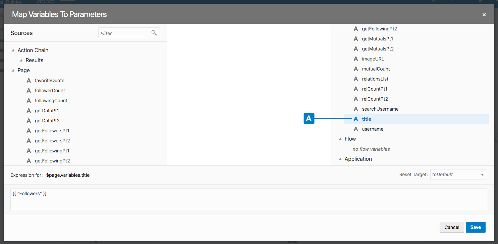
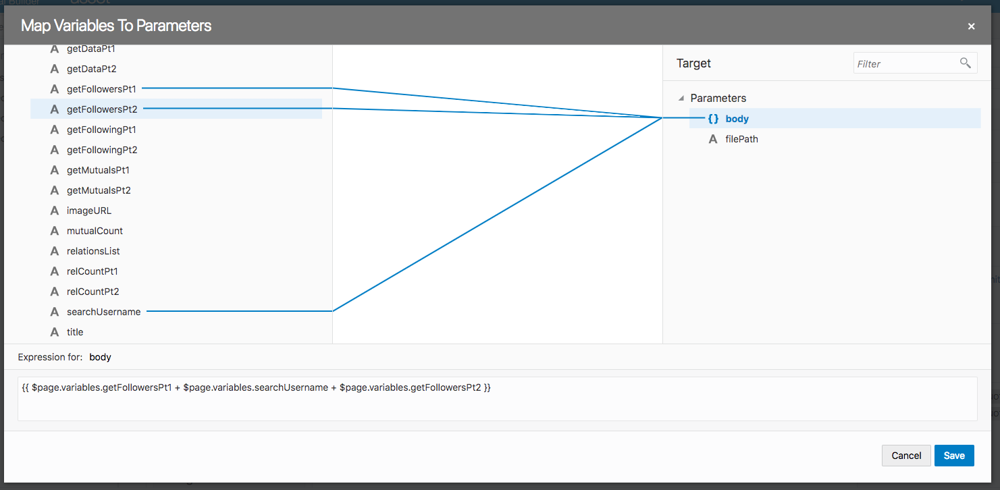
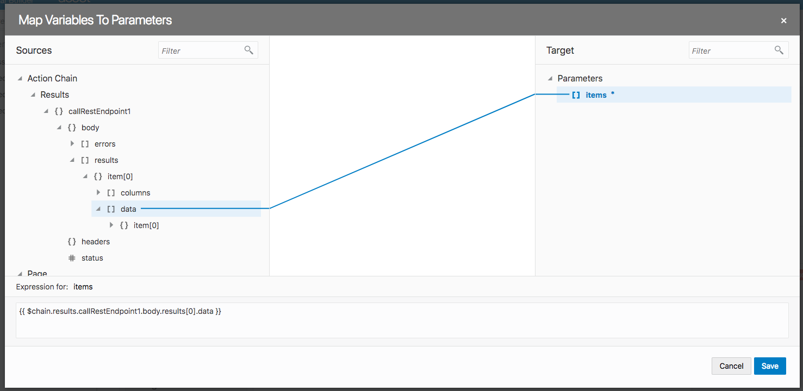
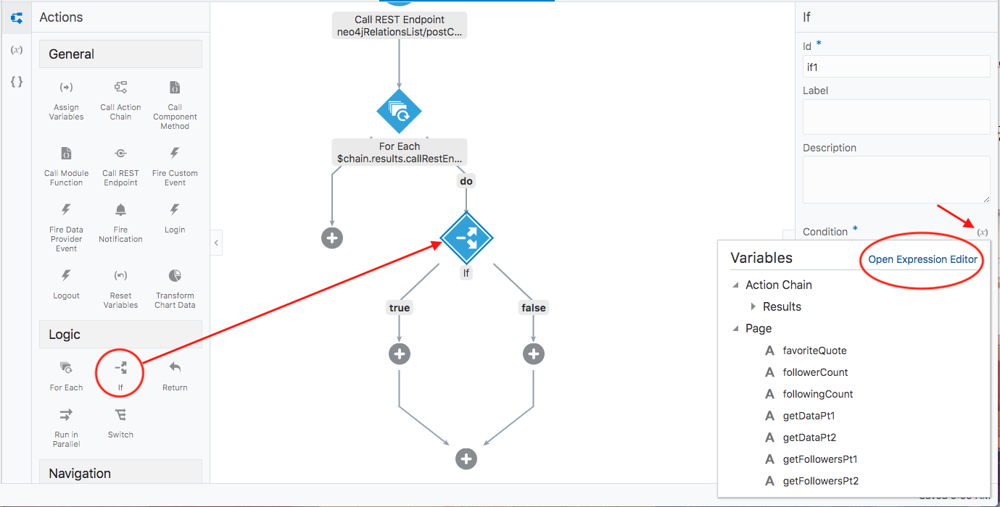
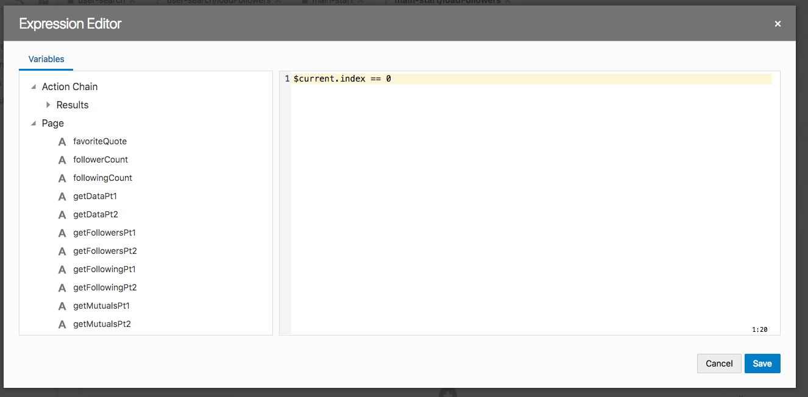
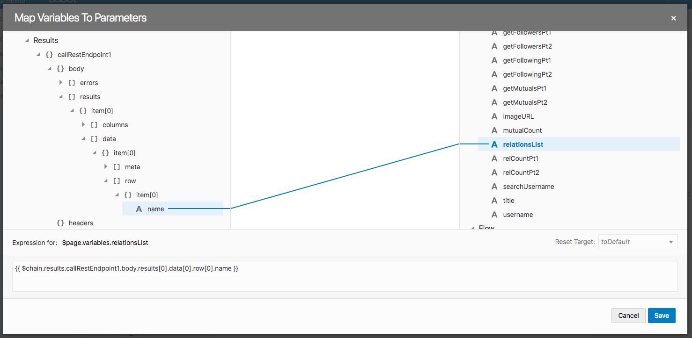
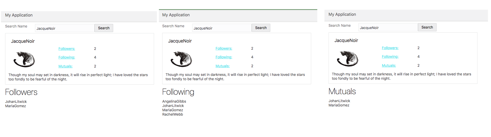

# rels listed

This page needs one last Service Connection. Create a `Neo4j Relationship List` connection, with the same settings as before except for Request and Response.<br>
<br>
Put in this code for Request:
```
{
 "statements": [
  {
   "statement": "MATCH (users)-[:FOLLOWS]-(userA:Person {name:'YukiTsukino'}) return users.name"
  }
 ]
}
```
Note, the relationship type being returned will be further specified in specific REST calls later. 
And this should be the Response:
```
{
    "results": [
        {
            "columns": [
                "users.name"
            ],
            "data": [
                {
                    "row": [
                        "VelmaGarcia"
                    ],
                    "meta": [
                        null
                    ]
                },
                {
                    "row": [
                        "JohanLitwick"
                    ],
                    "meta": [
                        null
                    ]
                },
                {
                    "row": [
                        "RajeshBishnoi"
                    ],
                    "meta": [
                        null
                    ]
                },
                {
                    "row": [
                        "RajeshBishnoi"
                    ],
                    "meta": [
                        null
                    ]
                },
                {
                    "row": [
                        "BobFlinstone"
                    ],
                    "meta": [
                        null
                    ]
                },
                {
                    "row": [
                        "RachelWebb"
                    ],
                    "meta": [
                        null
                    ]
                }
            ]
        }
    ],
    "errors": []
}
```

Now, our final set of variables.<br>

- getFollowersPt1 `{ "statements": [ { "statement": "MATCH (followers)-[:FOLLOWS]->(user:Person {name: '`
- getFollowersPt2 `' }) return followers"  } ]}`
- getFollowingPt1 `{  "statements": [   {    "statement": "MATCH (following)<-[:FOLLOWS]-(user:Person {name:'`
- getFollowingPt2 `'}) return following"   }  ] }`
- getMutualsPt1 `{  "statements": [   {    "statement": "MATCH (user:Person {name:'`
- getMutualsPt2 `'})-->(mutuals)-->(user) return mutuals"   }  ] }`

We're almost there, we just need to set up our Action Chains.<br>
<br>
Let's start with `loadFollowers`. First action will be Assign Variables. Click on `title` on the right. Fill in the bottom box with `"Followers"`. It will automatically add double curly brackets around the value.<br>
<br>
<br>
Next, Call REST Endpoint. Select  `Neo4j Relations List`, then map the request body:<br>
<br>
<br>
Drag and Drop a For Each action. Map its `items` array to the REST endpoint's `data` array. <br>
<br>
<br>
For each element in `data` the loop will run. <br>
<br> Now we need to add one more piece of logic, an If action to check whether or not we are on the first element in data. This is because what we will do next is append each follower name to our `relationsList` string. That is,<br>
`relationsList = follower1 + follower2 + follower3...`<br>
But if we simply always append to the end of relationsList, when we pull up the next list, say of mutuals, it'll display:<br>
`relationsList = follower1 + follower2 + follower3... + mutual1 + mutual2...`<br>
Instead of what we want,<br>
`relationsList = mutual1 + mutual2...`<br>
So, for the first element of the list, we should overwrite the `relationsList` variable, rather than append to the end of it.<br>
Drag and drop an If action under the **do** side of the For Each loop. Then set the condition using the Expression Editor.<br>
<br>
<br>
Then, inside the editor, simply put `$current.index == 0`.<br>
<br>
<br>
Drag two Assign Variables actions onto the Action Chain; one under **true**, and one under **false**. For under **true**,  simply assign the returned `name` to `relationsList.` <br>
<br>
<br>
For under **false**, drag and drop `relationsList` on the left to `relationsList` on the right. Then drag and drop `name` onto `relationsList`, but this time we will make a slight change. In the box below, change `data[0]` to say `data[$current.index]`. Finally, append a space between each name by adding `" " + ` right after the middle plus sign. <br>
The whole expression should look like this: `{{$page.variables.relationsList + "  " + $chain.results.callRestEndpoint1.body.results[0].data[$current.index].row[0].name }}` <br>
<br>
All together, the action chain should look like this:<br>
<br>
<br>
The set up for loadFollowing and loadMutuals is very similar. Only changes are:
- For `Assign Vaiables title` change the text to "Following" and "Mutuals" respectively.
- For the REST Endpoint, use getFollowingPt1 and Pt2, and getMutualsPt1 and Pt2.

To speed up the process, you can actually go to your actions and duplicate loadFollowers twice, delete loadFollowing and loadMutuals, then rename the copies accordingly. If you use the exact same name, you shouldn't have to reconnect them to the Event listeners. 
<br>
All right, let's test it out. Enter in a username and hit search. Then try clicking on each word: "Followers", "Following", and "Mutuals". <br>
<br>
<br>
